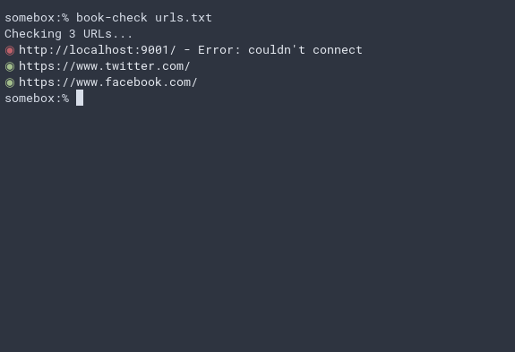

# BookCheck

Don't you hate it when you save a bunch of useful bookmarks only to later find out that some no longer work? This utility aims to make checking that list much easier!

## Installation

For now, you'll need a working installation of Rust. Rust can be installed by following the instructions here: <https://rustup.rs/>. Once installed, clone this repository and run `cargo install --path ./`.

## Usage

Simple: create a file with a list of URLs, one on each line, then run the utility like so:

